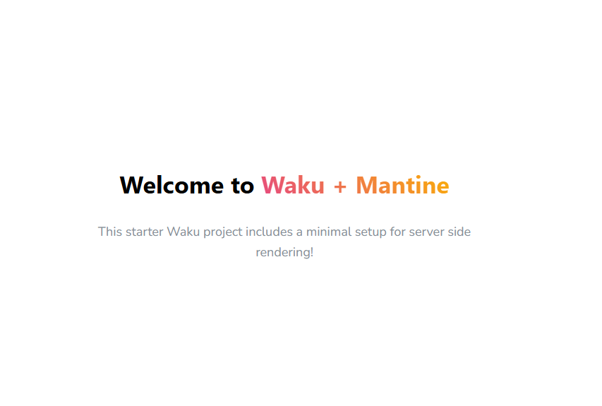

## Waku + Mantine
### Starter Kit

A minimal starter project with [Waku](https://waku.gg/) and [Mantine](https://mantine.dev/).

## Getting started

1. Clone the repository
2. Run `npm install`
3. Run `npm run dev`
4. Open [http://localhost:3000](http://localhost:3000) in your browser
